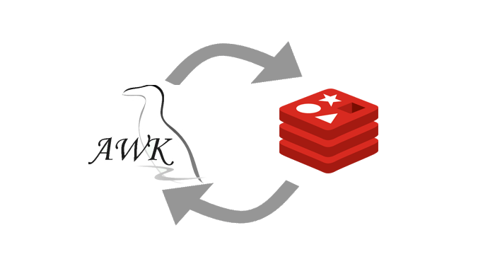

# gawk-redis

{:center=""}

A [GAWK](https://www.gnu.org/software/gawk/) (the GNU implementation of the AWK Programming Language) client library for Redis.

The gawk-redis is an extension library that enables GAWK , to process data from a [Redis server](http://redis.io/), then provides an API for communicating with the Redis key-value store, using [hiredis](https://github.com/redis/hiredis), a C client for Redis.

The prefix "redis_" must be at the beginning of each function name, as shown in the code examples, although the explanations are omitted for clarity.

## Installing/Configuring

Everything you should need to install gawk-redis on your system.

* Install [hiredis](https://github.com/redis/hiredis), library C client for Redis.

* The README file will explain how to build the Redis extensions for gawk.

* Interested in release candidates or unstable versions? [check the repository](https://sourceforge.net/u/paulinohuerta/gawkextlib_d/ci/master/tree/)

 You can try running the following gawk script, *myscript.awk*, which uses the extension:

{title="Example: Using gawk-redis extension",lang=text,linenos=off}
    @load "redis"
    BEGIN{
      # the connection with the server: 127.0.0.1:6379
      c=redis_connect()
      if(c==-1) {
        # always you can to use the ERRNO var for checking
        print ERRNO
      }
      # the select redis command
      ret=redis_select(c,4) 
      # The above statement assumes that db 4 contains data
      print "select returns "ret
      pong=redis_ping(c) # the ping redis command
      print "The server says: "pong
      # the echo redis command
      print redis_echo(c,"foobared")
      redis_close(c)
    }

which must run with:

`/path-to-gawk/gawk -f myscript.awk /dev/null`

## The API Functions

1. [Connection](#connection)
1. [Keys](#keys)
1. [Strings](#strings)
1. [Hashes](#hashes)
1. [Lists](#lists)
1. [Sets](#sets)
1. [Sorted sets](#sorted-sets)
1. [Pub/sub](#pubsub) 
1. [Pipelining](#pipelining)
1. [Scripting](#scripting)
1. [Server](#server)
1. [Transactions](#transactions)

